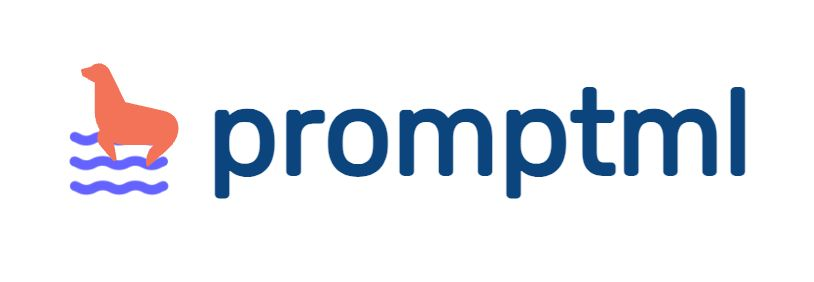

# PromptML (Prompt Markup Language)


<i>A simple, yet elegant markup language for defining AI Prompts as Code (APaC). Built to be used by AI agents to automatically prompt for other AI systems.</i>

The architecture is shown as below. A `PromptML` prompt can be version controlled like any other code file. Using promptml parser package, one can easily generate a natural language prompt, and execute it against a LLM. See examples for using promptml library package: [open examples](./examples/)


## Why PromptML ?
PromptML is built to provide a way for prompt engineers to define the AI prompts in a deterministic way. This is a Domain Specific Language (DSL) which defines characteristics of a prompt including context, objective, instructions and it's metadata.
A regular prompt is an amalgamation of all these aspects into one entity. PromptML splits it into multiple sections and makes the information explicit.

The language grammar can be found here: [grammar.lark](./src/promptml/grammar.lark)


## How PromptML looks ?
The language is simple. You start blocks with `@` section annotation. A section ends with `@end` marker. Comments are started with `#` key. The prompt files ends with `.pml` extension.

```pml
@prompt
    @context
    # Add prompt context
    @end
    @objective
    # This is the final question or ask
    @end
    @instructions
        @step
        # Add one or more instructions to execute the prompt
        @end
    @end
    @examples
        @example
            @input
            # Add your example input
            @end
            @output
            # Add your example output
            @end
        @end
    @end
    @constraints
    # Add prompt constraints
    @end
    @metadata
    # Add prompt metadata here
    @end
@end
```

See [prompt.pml](./prompt.pml) to see an example.

## Design
Regular text prompts are very abstract in nature. Natural languages are very flexible but provides least reliability. How to provide context for an AI system and ask something ? Shouldn't we specify that explicitly.
PromptML is an attempt to make contents of a prompt explicit with a simple language.

## Core tenets of PromptML
Below are the qualities PromptML brings to prompt engineering domain:

1. Standardization instead of fragmentation
2. Collaboration instead of confusion
3. Enabling version control-ability
4. Promoting verbosity for better results


## Why not use XML, YAML, or JSON for PromptML ?
First, XML, JSON, and YAML are not DSL languages. They are data formats that can represent any form of data. Second, generative AI needs a strict, yet flexible data language with fixed constraints which evolve along with the domain.

PromptML is built exactly to solve those two issues.

Language grammar is influenced by XML & Ruby, so if you know any one of them, you will feel very comfortable writing prompts in PromptML.

## Usage

1. Install Python requirements
```bash
pip install -r requirements.txt
```
2. import the parser and parse a promptML file
```py
from promptml.parser import PromptParser

promptml_code = '''
    @prompt
        @context
            This is the context section.
        @end

        @objective
            This is the objective section.
        @end

        @instructions
            @step
                Step 1
            @end
        @end

        @examples
            @example
                @input
                    Input example 1
                @end
                @output
                    Output example 1
                @end
            @end
        @end

        @constraints
            @length min: 1 max: 10
        @end

        @metadata
            @domain
                Web Development
            @end
            @difficulty
                Advaned
            @end
        @end
    @end
'''

parser = PromptParser(promptml_code)
prompt = parser.parse()

print(prompt)
# Output: {
#     'context': 'This is the context section.',
#     'objective': 'This is the objective section.',
#     'instructions': ['Step 1'],
#     'examples': [
#         {'input': 'Input example 1', 'output': 'Output example 1'}
#     ],
#     'constraints': {'length': {'min': 1, 'max': 10}},
#     'metadata': {'domain': 'Web Development', 'difficulty': 'Advanced'}
# }

```

## TODO
We are currently working on:

1. Supporting more annotations (Ex: temperature, top_p)
2. `VSCode` syntax highlighting support
3. Publishing `promptml` package to PyPi
4. Add more unit tests
5. Add support for `XML` & `YAML` serialization
