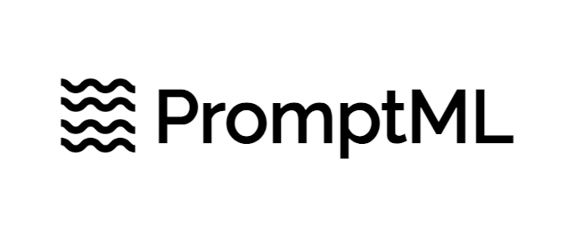

# PromptML (Prompt Markup Language)



<i>A simple, yet elegant markup language for defining AI Prompts as Code (APaC). Built to be used by AI agents to automatically prompt for other AI systems.</i>


## Why PromptML ?

PromptML is built to provide a way for prompt engineers to define the AI prompts in a deterministic way. This is a Domain Specific Language (DSL) which defines characteristics of a prompt including context, objective, instructions and it's metadata.
A regular prompt is an amalgamation of all these aspects into one entity. PromptML splits it into multiple sections and makes the information explicit.

The language grammar can be found here: [grammar.lark](./src/promptml/grammar.lark)

## How PromptML looks ?

The language is simple. You start blocks with `@` section annotation. A section ends with `@end` marker. Comments are started with `#` key. The prompt files ends with `.pml` extension.

```pml
@prompt
    # Add task context
    @context
    @end

    # Add task objective
    @objective
    # This is the final question or ask
    @end

    # Add one or more instructions to execute the prompt
    @instructions
        @step
        @end
    @end

    # Add one or more examples
    @examples
        @example
            @input
            # Add your example input
            @end
            @output
            # Add your example output
            @end
        @end
    @end

    # Add task constraints
    @constraints
        @length min: 1 max: 10  @end
    @end

    # Add prompt category
    @category
    @end

    # Add custom metadata
    @metadata
    @end
@end
```

See [prompt.pml](./prompt.pml) to see for complete syntax.

## Design

Regular text prompts are very abstract in nature. Natural languages are very flexible but provides least reliability. How to provide context for an AI system and ask something ? Shouldn't we specify that explicitly.
PromptML is an attempt to make contents of a prompt explicit with a simple language.

## Core tenets of PromptML

Below are the qualities PromptML brings to prompt engineering domain:

1. Standardization instead of fragmentation
2. Collaboration instead of confusion
3. Enabling version control-ability
4. Promoting verbosity for better results

## Why not use XML, YAML, or JSON for PromptML ?

First, XML, JSON, and YAML are not DSL languages. They are data formats that can represent any form of data. Second, generative AI needs a strict, yet flexible data language with fixed constraints which evolve along with the domain.

PromptML is built exactly to solve those two issues.

Language grammar is influenced by XML & Ruby, so if you know any one of them, you will feel very comfortable writing prompts in PromptML.

## Usage

1. Install Python requirements

```bash
pip install -r requirements.txt
```

2. import the parser and parse a promptML file

```py
from promptml.parser import PromptParser

promptml_code = '''
    @prompt
        @context
            This is the context section.
        @end

        @objective
            This is the objective section.
        @end

        @instructions
            @step
                Step 1
            @end
        @end

        @examples
            @example
                @input
                    Input example 1
                @end
                @output
                    Output example 1
                @end
            @end
        @end

        @category
            Prompt Management
        @end

        @constraints
            @length min: 1 max: 10 @end
        @end

        @metadata
            top_p: 0.9
            n: 1
            team: promptml
        @end
    @end
'''

parser = PromptParser(promptml_code)
prompt = parser.parse()

print(prompt)
# Output: {
#     'context': 'This is the context section.',
#     'objective': 'This is the objective section.',
#     'category': 'Prompt Management',
#     'instructions': ['Step 1'],
#     'examples': [
#         {'input': 'Input example 1', 'output': 'Output example 1'}
#     ],
#     'constraints': {'length': {'min': 1, 'max': 10}},
#     'metadata': {'top_p': 0.9, 'n': 1, 'team': 'promptml'}
# }
```

## Defining variables

You can define variables in the promptML file and use them in the prompt `context` and `objective`. The variables are defined in the `@vars` section and referenced using `$var` syntax in either `context` or `objective` sections.

```pml
@vars
    name = "John Doe"
@end

@prompt
    @context
        You are a name changing expert.
    @end

    @objective
        You have to change the name: $name to an ancient name.
    @end
@end
```


## Serialization
PromptML document can be serialized into multiple formats like:
1. XML
2. YAML
3. JSON

XML prompts are very-well understood by LLMs and promptML code can be used to generate an XML prompt like this:

From previous example in this README file, we can call a `to_xml()` method on `prompt` object to generate a XML prompt.

```python
# XML
serialized = prompt.to_xml()

print(serialized)
```

Similarly you can generate a YAML or JSON prompt respectively from the same object:

```python
# JSON
prompt.to_json()

# YAML
prompt.to_yaml()
```

## TODO

We are currently working on:

1. `VSCode` syntax highlighting support
2. Add more unit tests
3. Add RAG example
